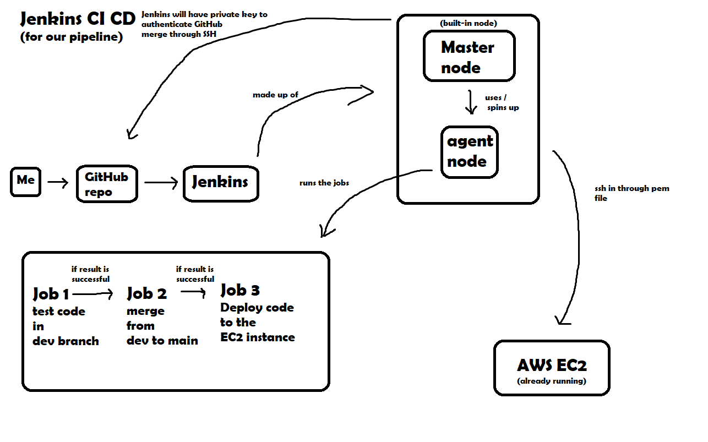

# CI / CD
- [CI / CD](#ci--cd)
  - [Continuous Integration](#continuous-integration)
  - [Continuous Delivery](#continuous-delivery)
  - [Continuous Deployment](#continuous-deployment)
  - [Differences between Continuous Delivery and Continuous Deployment](#differences-between-continuous-delivery-and-continuous-deployment)
  - [Jenkins](#jenkins)
    - [Benefits](#benefits)
    - [Disadvantages](#disadvantages)
    - [Stages of Jenkins](#stages-of-jenkins)
    - [Alternatives to Jenkins](#alternatives-to-jenkins)
    - [Why is it referred as a Pipeline?](#why-is-it-referred-as-a-pipeline)
    - [Why build a Pipeline?](#why-build-a-pipeline)
  - [Build a new project on Jenkins](#build-a-new-project-on-jenkins)
  - [Building a CI / CD pipeline with Jenkins](#building-a-ci--cd-pipeline-with-jenkins)
    - [Structure](#structure)
    - [Notes to integrate further](#notes-to-integrate-further)

CI / CD is essentially a set of practices:
* Continuous Integration
* Continuous Delivery/Deployment

## Continuous Integration

* Continuous Integration (CI) is a development practice where developers regularly integrate their code changes into a shared repository. Each integration triggers automated builds and tests, ensuring early detection of integration issues and promoting a more collaborative and efficient development process.
* Imagine merging tiny code changes frequently into a shared repository, followed by automated builds, tests, and feedback. 

## Continuous Delivery

* Continuous Delivery (CD) is an extension of CI by automatically deploying code changes to testing or staging environments after successful builds. It aims to make the delivery process more reliable and faster, allowing teams to release software more frequently and with greater confidence.
* This allows for faster deployments and smoother releases.
* What is delivered?
  * Ready to be deployed code.
  * Will create artifacts (e.g. jar file in java)

## Continuous Deployment

Continuous deployment is a strategy in software development where code changes to an application are released automatically into the production environment.
* It's faster for end users.
* There's continuous feedback from end users to developers)

## Differences between Continuous Delivery and Continuous Deployment

* Continuous Deployment (CDE): Involves automatically deploying code changes directly to production after successful testing, with minimal manual intervention.

* Continuous Delivery (CD): Focuses on automatically delivering code changes to non-production environments, leaving the decision to deploy to production to a manual trigger.

* We can think of it like this: CD builds a bridge between our code and various environments, while CDE pushes changes directly to production, like a highway with no exits. Both offer speed and efficiency, but CDE demands stricter quality control.

## Jenkins

Jenkins is an open-source automation server used for building, testing, and deploying code changes. It supports Continuous Integration and Continuous Delivery by automating the software development process.

### Benefits

* Automation - Jenkins automates repetitive tasks, which reduces manual errors and improves efficiency.
* Integration - It integrates with a wide range of tools and plugins, providing flexibility in the development ecosystem.
* Extensibility - Jenkins is highly extensible, allowing users to create custom plugins or integrate existing ones.
* Scalability - With Jenkins, we're able to manage CI/CD for small or large projects.
* Community - Jenkins has a very extensive community, which gives access to extensive documentation and support.

### Disadvantages

* Complexity - Setting up, configuring and maintaining Jenkins can be challenging.
* Security - Keeping Jenkins secure requires constant vigilance. (Why?)
* Resource Consumption - Jenkins may require significant resources, and improper configuration can lead to performance issues.

### Stages of Jenkins

1. Source code management - Fetching the source code from version control.
2. Build - Compile and package the application.
3. Test - Run unit and integration tests to ensure functionality.
4. Deploy - Push the code to various environments (staging, testing, production).
5. Monitor - Monitoring and collecting feedback on the deployed application. During this process we track the performance and stability of the deployment.

### Alternatives to Jenkins

There's a few alternatives to using Jenkins:

* GitHub Actions - Which has built-in CI/CD platform for GitHub repositories.
* CircleCI - It's a cloud-based CI/CD platform with a user-friendly interface.
* Travis CI - Open-source CI/CD platform known for its ease of use.
* TeamCity
* Bamboo

### Why is it referred as a Pipeline?

A CI/CD pipeline is an automated software delivery process that combines the practices of continuous integration (CI) and continuous delivery (CD). It is essentially an assembly line for building, testing, and deploying software updates.

### Why build a Pipeline?

There's several compelling reasons to build a CI/CD pipeline:
* The biggest reason to have CI/CD pipelines is to get the usable software into the hands of the end users. 
* Increased speed and efficiency:
* Improved quality and reliability / Consistency:
* Enhanced collaboration and communication:

## Build a new project on Jenkins

1 - When logged in to Jenkins, select to create a new Item.

2 -  Give a general description.
3 - Select to Discard old builds (this will set up a limit of how many builds we want there to be stored)

4 - In build steps, select execute shell and then write the commands we want the shell to execute.

5 - If we want to string multiple projects/jobs, we can go to Post-Build Actions and select which project to run after the first one builds successfully.

## Building a CI / CD pipeline with Jenkins

1 - The first Steps will be to create an SSH key-pair and associate the public key with the specific repo that we want Jenkins to have access to.

2 - Next, we'll want to create the first job, which will be responsible for doing the testing.

* For that, we'll create a new freestyle project and give it a descriptive name. On the `Configure` section, give it a general description and just like above, we decided to keep a maximum of 3 builds in history.

3 - On source code Management section, we'll select Git:
  * Get the repository's SSH URL on the specific section.
  * Add Credentials(Private Key):
    * In `Kind` section, choose `SSH Username with private key`.
    * For ID and username, give the name of the file of the private key.
    * For description, type `read/write to repo`.
    * Enter the private key.
    * Press Add.
    * Back on the credenitals section, select the credential that was just added.

  * On branches to build, correct `*/master` to `*/main`.

4 - On Build Tests, we'll select `Invoke top-level Maven targets`:
  * Select the required Maven Version.
  * For goals, type `package test`, to run both of those goals in that order.

5 - Webhook

* In the `Configure` section in the job/project that we want to be triggered, we'll go to Source Code Management and change the Branch Specifier to `*/dev`.

* In the same page, go to the `Build Triggers` section and select the `GitHub hook trigger for GITScm polling`.

* Go over to to the GitHub repository that we want to trigger the pipeline.
* Go to Settings and select `Webhooks`.
* Select add webhook and then place the jenkins URL followed by `/github-webhook/`.
* Make sure that the option is only to trigger due to a push.

6 - Post-Build Actions Job 1

* Once Job/Project 2 has been created, add this Job 2 to build after Job 1 is finished.

7 - Create Job to merge dev branch to the main branch.

* On Source Code management, keep the same initial part as in the previous job.
* Add additional behaviours and choose `Merge Before Build`.
  * We can leave the name of the repository blank if you want it to be origin.
  * Set the branch you want to merge to as `main`.
  * Leave the rest of the options as they were.

* On Post-build Actions, choose `Git Publisher`:
  * Select `Select Push Only if Build Succeeds`.
  * Select `Merge Results`.

### Structure

### Notes to integrate further

* When a change is made in dev, have they been fully tested yet? There should be a system to of how you test it.
* Main branch is production ready code only.
* Pipeline will take care of testing and mergin into dev.
