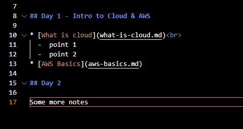

# Week 1 AWS - Linux

- [Week 1 AWS - Linux](#week-1-aws---linux)
  - [Day 1 - Intro to Cloud \& AWS](#day-1---intro-to-cloud--aws)
  - [Day 2](#day-2)
  - [Day 3](#day-3)
  - [How to chance directory in Linux](#how-to-chance-directory-in-linux)


## Day 1 - Intro to Cloud & AWS

* [What is cloud](what-is-cloud)
* [AWS Basics](aws-basics)


## Day 2

* [Creating an EC2 Instance](ec2-instance)
* [Linux Commands](linux-commands)
* [File Ownership](file-ownership)

## Day 3

* [Building a Script in Linux](building-a-script)




## How to chance directory in Linux

Change directory using this command: `cd <directory>`

Change directory using this command:

```
cd <directory>
<other commands>
```

