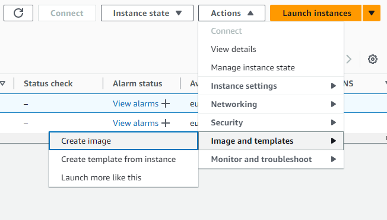
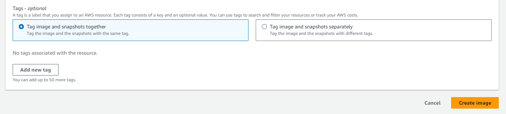
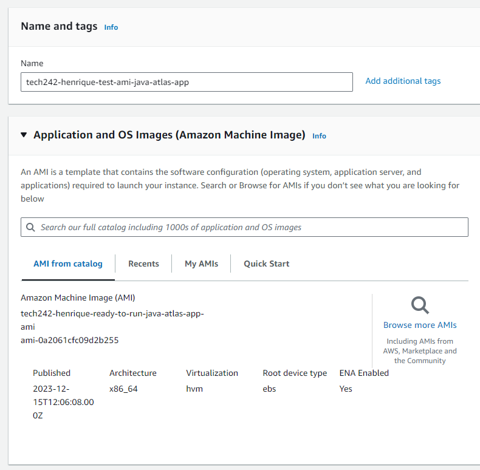
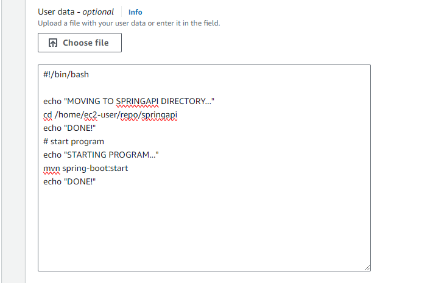

# AMI - Amazon Machine Image

An AMI or Amazon Machine Image is a template that simplifies the process of launching and managing virtual servers (or instances) in the cloud.

In essence, we create an AMI by creating a snapshot of the current EC2 instance that is running.
So the newly created will be a template that has everything that we have already installed and/or cloned in our original EC2 Instance. 
The main advantage of an AMI is that launching an instance using the AMI and user data significantly reduces the time to deploy the app.

## Creating an AMI

1. Create Image of Running EC2 Instance

2. We'll need to give it a descriptive name and add a tag with key value pair.
   * Key: Name
   * Value: name that was given to instance 

## Launch instance From AMI

Once the Image has finished assembling, we'll need to launch an instance from it.

1. Give a descriptive name to AMI instance (AMI will already be selected for the one where launching an instance from)

2. Select same Key Pair
3. Select the security group.
4. Add the last pat of previous user data:
   1. `#!/bin/bash`
   2. Command to go into desired repository: `cd /home/ec2-user/repo/springapi`
   3. Command to start running application: `mvn spring-boot:start`

