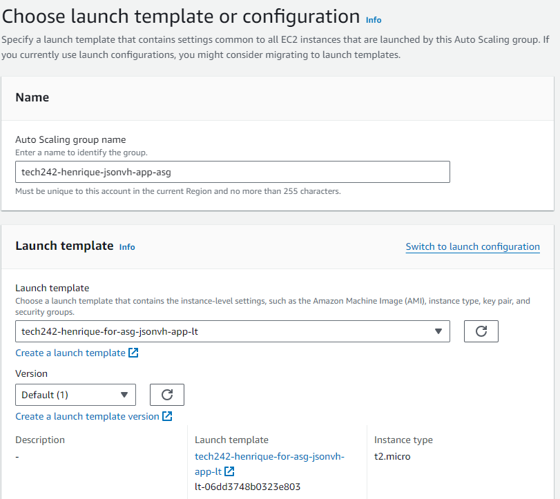
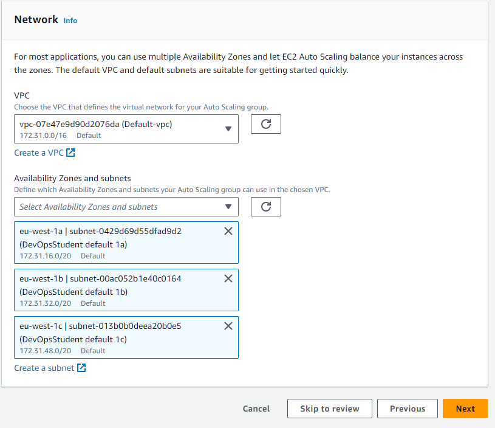
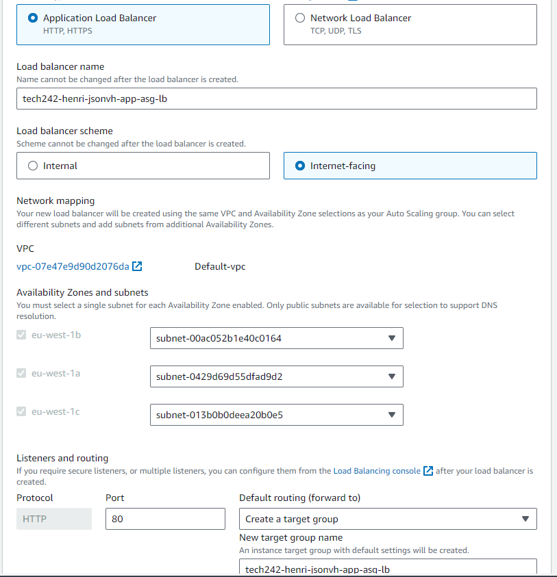
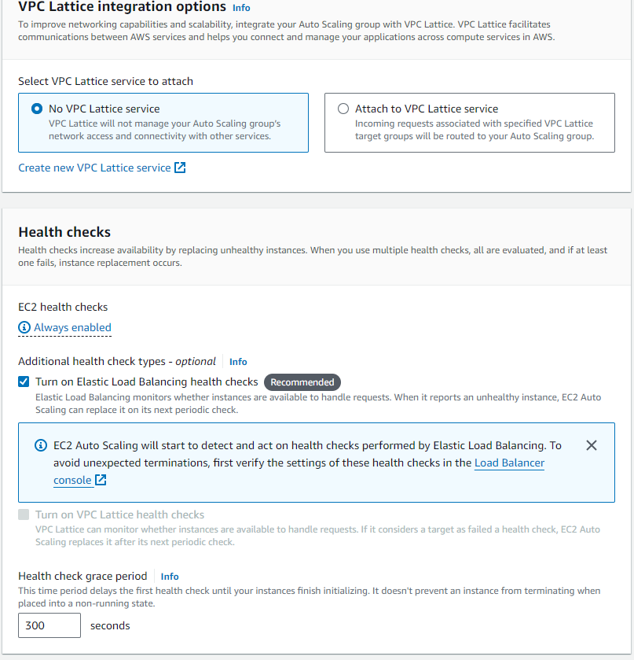
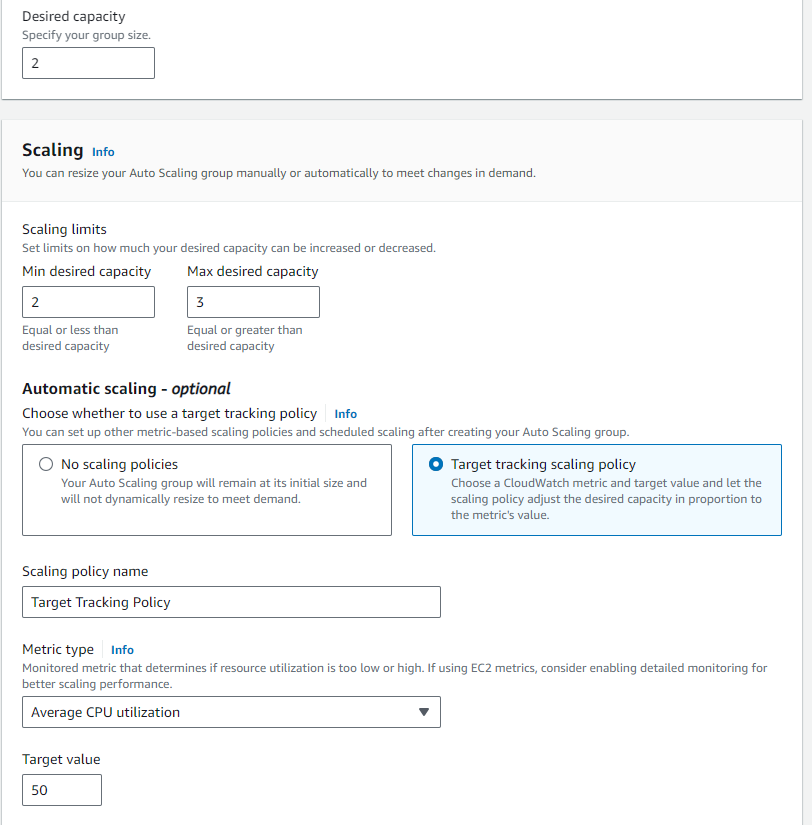
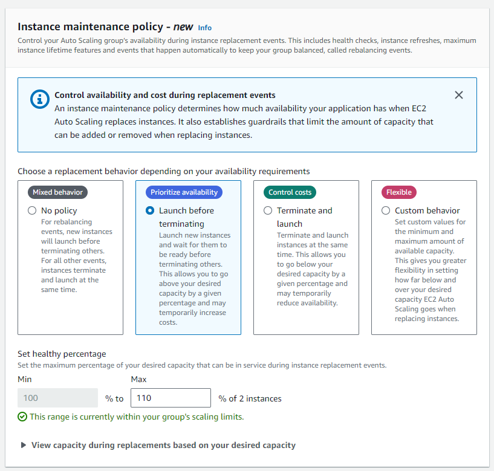
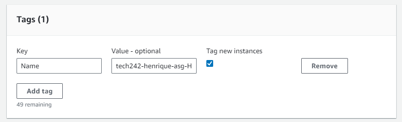

# Auto Scaling Groups

## Diagram 

## Steps to creating an Auto Scaling Group

### 1. Have a Virtual Machine Running

### 2. Make an AMI out of that VM

### 3. Create a Launch Template

* In the launch template, we want to specify anything that we would usually need to run that Virtual Machine from an AMI.
  * Select correct AMI.
  * Instance Type
  * Key Pair (for login in)
  * Security Group.
  * User Data.

### 4. Test Launch Template

* It's important to test the launch template to make sure the instances it creates aer functional virtual machines that go according to our initial requirements.

### 5. Create Auto Scaling Group

#### 5a. For creating an auto scaling group, we'll need to first give it a descriptive name and select the desired launch template.

##### 5b. Next, we'll need to select the VPC and the Availability Zones and subnets. In this case, we only want to select availability zones 1a, 1b, 1c.

##### 5c. Attach to a load balancer

* In our case, we'll want to attach to a new load balancer. 
* For that, we'll have to select its:
  * Type (Application or Network Load Balancer)
  * Name
  * Load Balancer Scheme (Internal or Internet Facing)
  * Network Mapping (so it matches the AZ selected earlier)
  * Listeners and Routing (In this case, we'll create a new target group)
  * VPC Lattice Integration Options
  * Health Checks (Elastic Load Balancing health Checks)
  * The grace period is a period that will delay the first health check until our instances finish initializing.

##### 5d. Configure Group Size and Scaling

Here we'll need to select the desired capacity for our auto scaling group as well as the minimum and maximum scaling limits.

We'll need to add a target tracking Policy that uses Average CPU utilization as a monitored metric to determine if resource utilization is too low or too high.

We set the target value to 50 (average between all VMs).

We'll also need to add an instance maintenance policy that prioritizes availability (in this case).

#### 5e. Adding tags

We'll want to add a tag so that we can easily find instances that are created by this auto scaling group.

