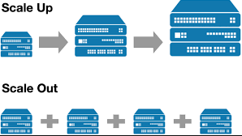

# Auto Scaling Groups

- [Auto Scaling Groups](#auto-scaling-groups)
  - [Scaling](#scaling)
    - [Vertical Scaling](#vertical-scaling)
      - [Limitations](#limitations)
    - [Horizontal Scaling](#horizontal-scaling)
  - [Auto-Scaling](#auto-scaling)
  - [Diagram](#diagram)
  - [Steps to creating an Auto Scaling Group](#steps-to-creating-an-auto-scaling-group)
    - [1. Have a Virtual Machine Running](#1-have-a-virtual-machine-running)
    - [2. Make an AMI out of that VM](#2-make-an-ami-out-of-that-vm)
    - [3. Create a Launch Template](#3-create-a-launch-template)
    - [4. Test Launch Template](#4-test-launch-template)
    - [5. Create Auto Scaling Group](#5-create-auto-scaling-group)
      - [5a. For creating an auto scaling group, we'll need to first give it a descriptive name and select the desired launch template.](#5a-for-creating-an-auto-scaling-group-well-need-to-first-give-it-a-descriptive-name-and-select-the-desired-launch-template)
        - [5b. Next, we'll need to select the VPC and the Availability Zones and subnets. In this case, we only want to select availability zones 1a, 1b, 1c.](#5b-next-well-need-to-select-the-vpc-and-the-availability-zones-and-subnets-in-this-case-we-only-want-to-select-availability-zones-1a-1b-1c)
        - [5c. Attach to a load balancer](#5c-attach-to-a-load-balancer)
        - [5d. Configure Group Size and Scaling](#5d-configure-group-size-and-scaling)
      - [5e. Adding tags](#5e-adding-tags)

## Scaling

Scaling is the ability to handle increeased workload or demand by expanding the resources, infrastucture or processes of a system. 

Scaling is crucial in DevOps to ensure that applications and systems can handle increased traffic, data, or computational requirements. 

There are two main types of Scaling:
* Vertical Scaling (Scaling Up / Down)
* Horizontal Scaling (Scaling Out / In)

### Vertical Scaling

This involves adding more resources to an existing server or upgrading its hardware. 

* When scaling up, it is like saying we want another Virtual Machine with more memory and more CPU.
* Scaling down would be the opposite.

In this type of scaling, the workload will have to be moved from the existing VM to the new VM. After the workload has been moved, the previous VM is terminated.

#### Limitations

* Vertical scaling is often limited by the capacity of a single machine and may not be as cost-effective as horizontal scaling.
* Scaling down presents more challenges.

### Horizontal Scaling

This involves adding more machines or nodes to a system, distributing the workload across multiple servers. 

Horizontal Scaling is typically more scalable and cost-effective than vertical scaling because it allows for the addition of resources in smaller increments and takes advantage of the ability to run in parallel.

* Scaling Out - Will create more virtual machines as needed to fulfill demand.
* Scaling In - Will terminate the virtual machines if there is no need to have that many Virtual Machines for current demand.

## Auto-Scaling

With Auto-Scaling Groups, systems can automatically adjust their resources based on predefined metrics or thresholds. This ensures that the infrastructure can adapt to varying workloads without manual intervention.

## Diagram 

## Steps to creating an Auto Scaling Group

### 1. Have a Virtual Machine Running

### 2. Make an AMI out of that VM

### 3. Create a Launch Template

* In the launch template, we want to specify anything that we would usually need to run that Virtual Machine from an AMI.
  * Select correct AMI.
  * Instance Type
  * Key Pair (for login in)
  * Security Group.
  * User Data.

### 4. Test Launch Template

* It's important to test the launch template to make sure the instances it creates aer functional virtual machines that go according to our initial requirements.

### 5. Create Auto Scaling Group

#### 5a. For creating an auto scaling group, we'll need to first give it a descriptive name and select the desired launch template.

##### 5b. Next, we'll need to select the VPC and the Availability Zones and subnets. In this case, we only want to select availability zones 1a, 1b, 1c.

##### 5c. Attach to a load balancer

* In our case, we'll want to attach to a new load balancer. 
* For that, we'll have to select its:
  * Type (Application or Network Load Balancer)
  * Name
  * Load Balancer Scheme (Internal or Internet Facing)
  * Network Mapping (so it matches the AZ selected earlier)
  * Listeners and Routing (In this case, we'll create a new target group)
  * VPC Lattice Integration Options
  * Health Checks (Elastic Load Balancing health Checks)
  * The grace period is a period that will delay the first health check until our instances finish initializing.

##### 5d. Configure Group Size and Scaling

Here we'll need to select the desired capacity for our auto scaling group as well as the minimum and maximum scaling limits.

We'll need to add a target tracking Policy that uses Average CPU utilization as a monitored metric to determine if resource utilization is too low or too high.

We set the target value to 50 (average between all VMs).

We'll also need to add an instance maintenance policy that prioritizes availability (in this case).

#### 5e. Adding tags

We'll want to add a tag so that we can easily find instances that are created by this auto scaling group.

