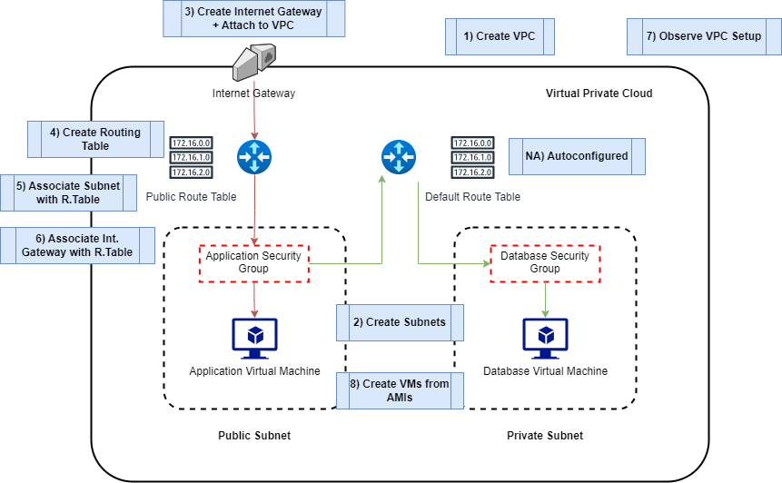

# AWS Virtual Private Cloud (VPC)

- [AWS Virtual Private Cloud (VPC)](#aws-virtual-private-cloud-vpc)
  - [Architecture for custom VPC](#architecture-for-custom-vpc)

When you create an aws account there is a vpc that is created for us in every region
Like having our own apartment o flat in a shared building by default.
We just get it automatically.

We shae a "flat" with spata.

There's 3 availability zones in Ierland.
There are three rooms which are thee by default. 
Each room or subnet can have one availability zone.
*Default SubNetsn(public)
 * 1a
 * 1b
 * 1c

A subnet is related to an availability zone.
There is a subnet for EACH availability zone.

Why is it bad to have shared vpc:
 *Scuruty concerns
  * We can increase secuity by specifying only u own IP can SSH in to VM
  * Key pair

In a custom vpc we can decide which subnets (rooms in analogy) are private and which ones are public.
 * One of them will be public and the other private.

Every device has 

On a tcp ip network every device needs an ip address.
We need an IP address range:
 * It is decided by a cider block

10.0.0.0.16

* 10.0.0.0 - vesion four ip address. - Each of those numbers can range from 0 on to 255. IN theory you can have 256 ip addresses for a subnet that has 10.0.0.0/24.
* Each one of the spots we can have a numeral can take up to 8 bits. 
* the number 16 specifies how many bits are fixed/locked in the cdir block.
* Which means the first two numbers can't be changed.  But the other ones can.
* Possibilities ae determined by the non-fixed bits multiplied by each othe.

You would use 10.0.0.0/32 if you only want an IP address.

*Put screenshot of VPC here*

## Architecture for custom VPC

The first thing to consider is the VPC CDIR Block (10.0.0.0/16) which will determine the IP addresses of our subnets.

Inside our VPC, we'll have two Subnets:
* Public Subnet (10.0.2.0/24):
  * Will contain ou App/Api Virtual Machine.
* Private Subnet (10.0.3.0/24):
  * Will contain our Database Virtual Machine.

After that we'll have to consider the router:
* The router is a component of a VPC that works in the background.
* The router's function is to redirect traffic where it needs to go.
* By default, when we set up a custom VPC, the outer will have a default route table:
  * The route table controls where traffic is directed.
  * The default route table only allows for traffic within the VPC, which means it does not allow traffic from the outside.
* So that our app can communicate with the outside, we'll need to create our own public route table which will define the public traffic.

