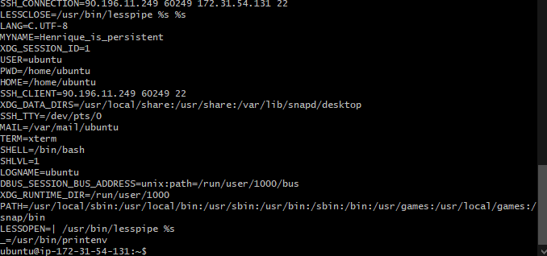

# Building a Script in Linux

### Create a new script file

Create a filen empty file with the file extension `.sh` (sh for shell).
We can ither create this file by using `touch` or `nano` commands.

### Plan our script

One of the imporatnt steps of creating a script is to plan how the script is going to work, or what steps it will take before starting to write our script.
* Example:
  ```
  #!/bin/bash 

  # update

  # upgrade

  # install nginx

  # restart nginx

  # enable nginx
  ```

Note:

* Upgrade to the latest packages is pottentially dangerous as it will isntall latest versions to the OS that could break something.

### Manual Testing

The next step is to test every command we are going to use manually. 
    * This is imporatnt because we need to make sure that the commands are working as intended before adding them to the script / automate them.

Order of test:

* `sudo apt update -y`
* `sudo apt upgrade -y` 
* `sudo apt install nginx -y`
* `sudo systemctl status nginx` - To check a system process is running. We can also check this process by going to the EC2 instance and get the public IPv4 address, then copy and paste it into the browser. `ctrl + z, Enter Key` to exit and regain control of the terminal or `ctrl + c` 
* `sudo systemctl restart nginx` 
* `sudo systemctl enable nginx`

`apt` -> Relates to package manager
`systemctl` -> System control, manages system processes

### How to run a script file

First we'll need to provide the path for that script - need to tell it where that script is.

`./<file-name>` -> tells the shell to look for the file in the current working directory.
Important to remember that the file needs the permission to be executed.

We can check the file / directory permissions by using the `ls -l` command.

Give executing permissions to all users:
* `sudo chmod +x <filename>`

Note: Colour of the file when using the `ls -l` command will show that the command has executable permissions.

* Best Practice
  * Edit script file to make sure we have more assistance to help with troubleshooting.
  * We can add the `echo` command to display a word or string to the terminal.
  * `echo hello` - for a single word, echo will display that word
  * `echo "This is an echo"` - for more than one word, we'll need to use quotation marks


### How to check if script is working as intended

There's two ways to check if the script is working properly:
  * 1 - We want to run the scripts on a fresh virtual machine.
  * 2 - The Script will run no matter how many times we want it to run and work every time.

This has to do with the concept of idempotency (or idempotent).
If the script runs for the first and every subsequent time (and works), then the script is idempotent.


### Environment Variables

A variable is something that you want to store in memory.
By convention , we should name variables in capital letters.
To display those variables we need to use the command `echo $<variable-name>`.
Variables are important as we may want to use a certain information several times in a script, for example.


This variable is not an environment variable. to create an environment variable, we'll need to utilize the `export <variable>`.
This new variable will not only be considered an environment variable, but also be treated as just a variable.
If we already had a variable with the same name before, when we use the command `export` it will replace the previous one in memory.
We can find out which ones are environment variables by utilizing the `printenv` command.



Certain commands such as `pwd` will return the value that is assigned to the PWD environment variable.
Environment variables are often used to store sensitive information.

IMPORTANT: Never hardcode credentials! We would instead use environment variables to store those credentials.

Note: Root has its own set of environment variables and we'll be able to see them by using the command `sudo printenv`.

#### Persistency of Environment Variables

An Environment variable is not persistent so it will disappear as soon as that terminal session is finished.
To define and keep an environment variable, we'll need to define it in a file that loads up when we begin the session.

* For this purpose, we can add it to the `.bashrc` file.
* All we'll need to do is go to the bottom of the file and add the `export <variable>`.
* That environment variable will still not be accessible as that file loads when the terminal starts.
* Because of that, we can use the command `source .bashrc` to reload the file.


Note: Often we win't need environment variables to be persistent but we might need to create them in order to access them later through scripts.
