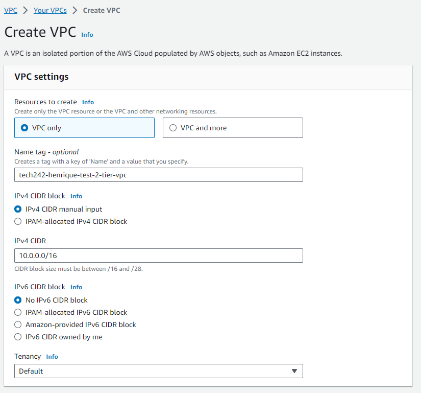
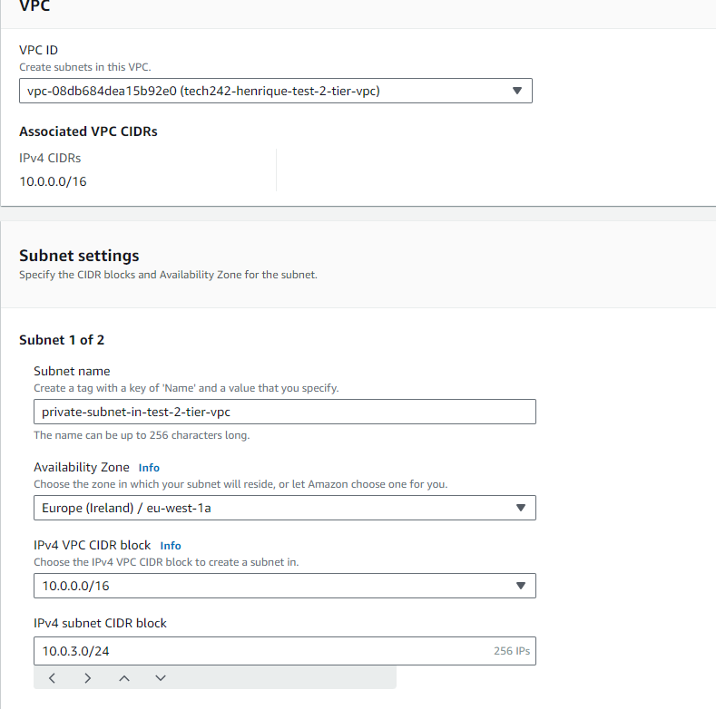
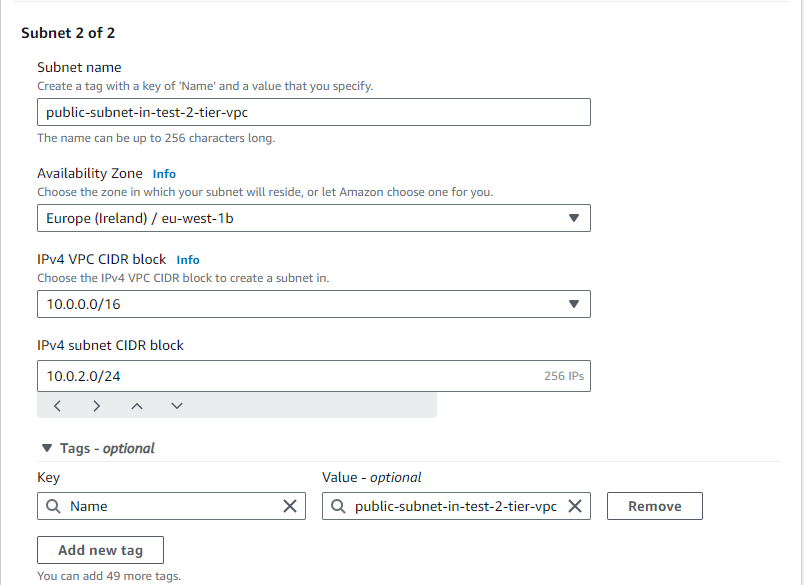
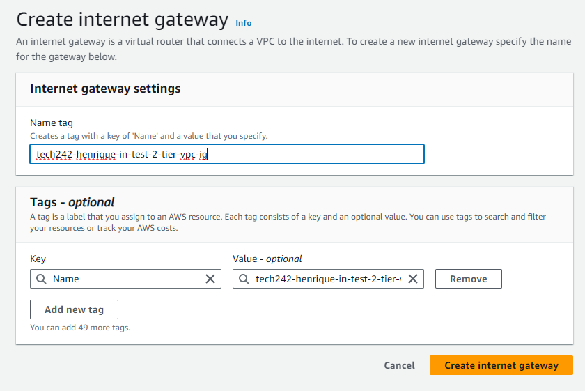
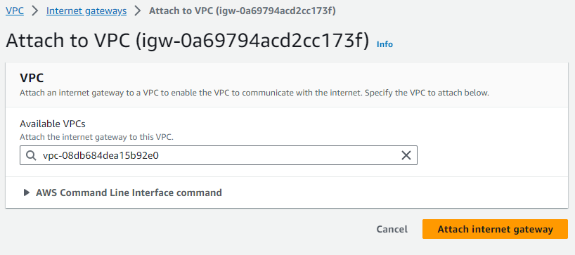
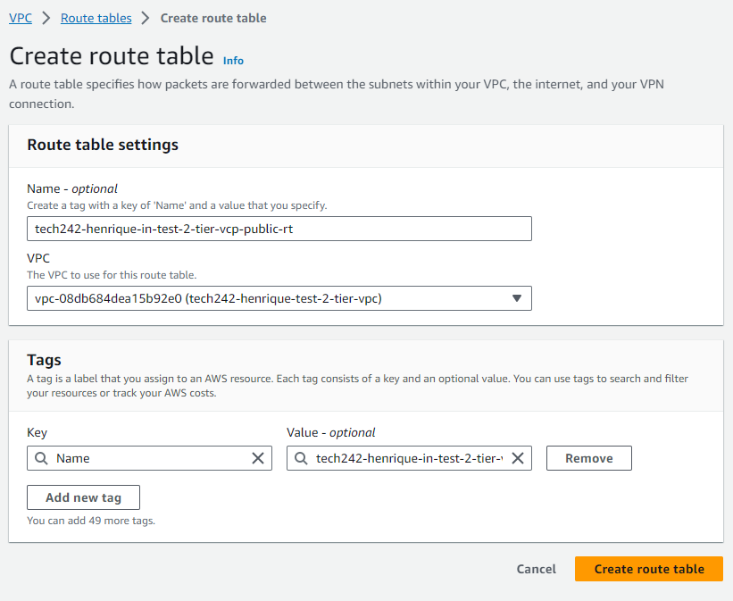
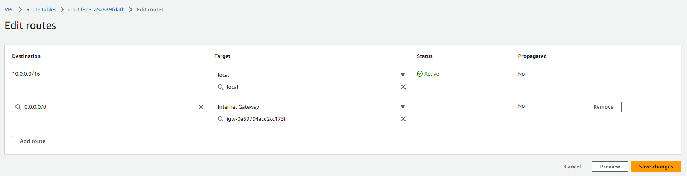
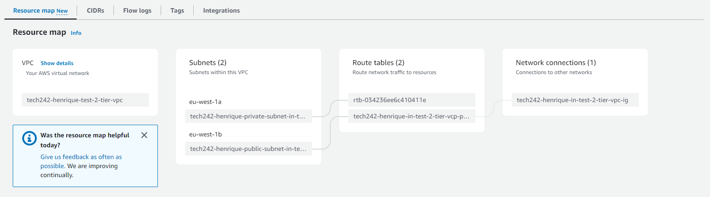
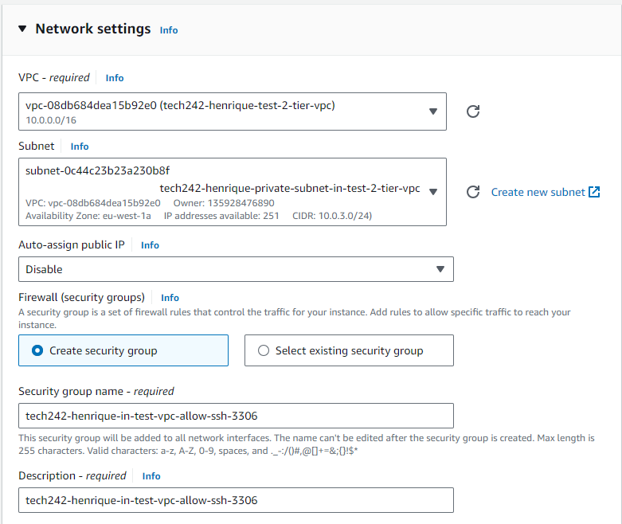
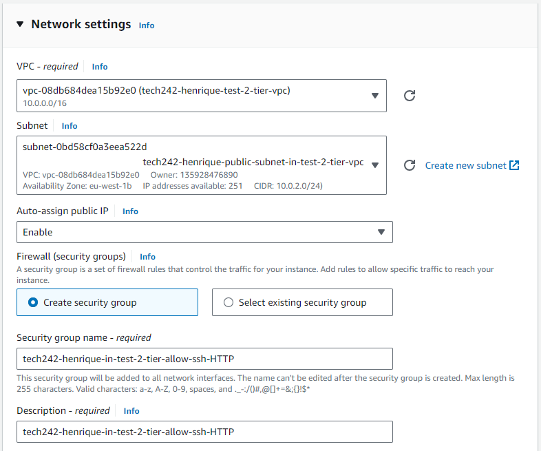

# Creating a VPC

In order to create and set up a VPC there's a set of steps we need to follow:

1 - Create VPC

2 - Creating each of the subnets

3 - Create the internet gateway

 3a - Attach internet gateway to VPC

 

4 - Create Public Route Table

5 - Associate the public route table with the subnet

6 - Add internet gateway to the route

7 - Check to see if VPC is setup correctly

8 - Add database virtual machine to private subnet

    * The most important thing to remember is that a security group is specific to a VPC. That being the case, we cannot use a security group from a different VPC and will have to create our own.
    * Assign correct VPC.
    * Assign desired Subnet (private).
    * Disable public IP address.

9 - Add API virtual machine to public subnet

    * Like in the previous VM, we want to make sure the security group is associated to the same VPC.
      * Assign correct VPC.
      * Assign public Subnet.
      * Enable public IP address.
    * Additionally, we cannot forget to add the necessary piece of user data script.

10 - Check to see if api vm is accessed through internet

