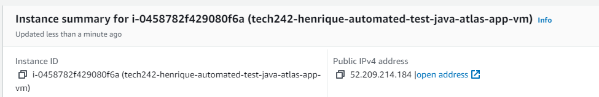
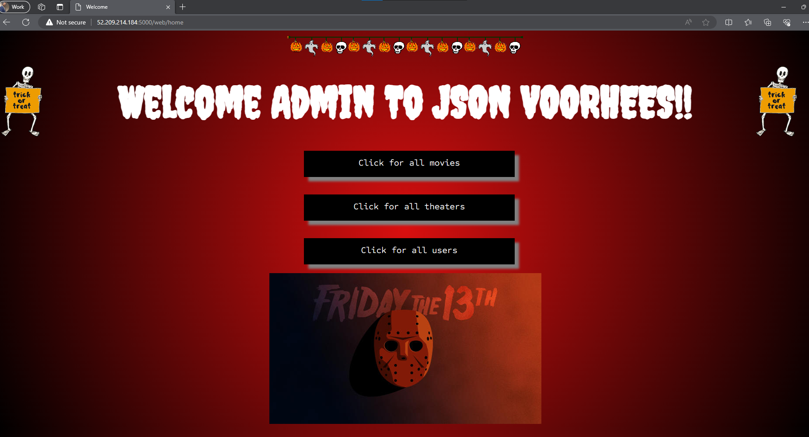

# Deploy a Java Atlas App

- [Deploy a Java Atlas App](#deploy-a-java-atlas-app)
  - [Steps](#steps)
    - [Plan Script](#plan-script)
    - [Test everything manually](#test-everything-manually)
    - [Assemble Script](#assemble-script)
    - [Testing automation in new VM](#testing-automation-in-new-vm)


## Steps

* Create and launch new EC2 Instance
* Connect to terminal via SSH
* Create a new script file
* Plan script
* Test everything manually
* Assemble Script

### Plan Script

  ```
  #!/bin/bash 

  # update & upgrade

  # install maven

  # check maven is installed

  # install java 17

  # check java 17 is installed

  # copy code into vm
  ```

  ### Test everything manually

  * Update command ran without any issues arising `sudo apt update -y`
  * Upgrade method ran but an issue with kernel installation arose that requested user input: `sudo apt upgrade -y`
  * Need to alter command to avoid having user interaction in order to automate: `sudo DEBIAN_FRONTEND=noninteractive apt upgrade -y`
  * Same issue arose for all other install commands
  * Install command for maven: `sudo DEBIAN_FRONTEND=noninteractive apt install maven -y`
  * Check to see maven is installed: `mvn -version`
  * Install command for java: `sudo DEBIAN_FRONTEND=noninteractive apt install openjdk-17-jdk -y`
  * Check to see java is installed: `java -version`
  * How to copy file from local machine to VM: `scp -i ~/.ssh/key ~/Documents/example-to-send.txt user@vm-public-ip-address:~`
  * How to copy folder from local machine to VM: `scp -r -i ~/.ssh/key ~/Documents/ExampleFolder user@vm-public-ip-address:~`
  * Clone github repository to vm: `git clone https://HenriqueMCunha@github.com/HenriqueMCunha/tech242-jsonvoorhees-app.git`
  * Move to desired repository `cd tech242-jsonvoorhees-app/springapi`
  * Start program `mvn spring-boot:start`

### Assemble Script

```
#!/bin/bash

# update & upgrade
echo "UPDATING..."
sudo apt update -y
echo "DONE!"
echo "UPGRADING..."
sudo DEBIAN_FRONTEND=noninteractive apt upgrade -y
echo "DONE!"
# install maven
echo "INSTALLING MAVEN..."
sudo DEBIAN_FRONTEND=noninteractive apt install maven -y
echo "DONE!"
# check maven is installed
echo "CHECKING MAVEN VERSION..."
mvn -version
echo "DONE!"
# Install JDK (Java) 17
echo "INSTALLING JDK 17..."
sudo DEBIAN_FRONTEND=noninteractive apt install openjdk-17-jdk -y
echo "DONE!"
# check java is installed
echo "CHECKING JAVA VERSION..."
java -version
echo "DONE!"
# copy the app code to this VM
echo "CLONING REPOSITORY..."
git clone https://HenriqueMCunha@github.com/HenriqueMCunha/tech242-jsonvoorhees-app.git
echo "DONE!"
# move to springapi
echo "MOVING TO SPRINGAPI DIRECTORY..."
cd tech242-jsonvoorhees-app/springapi
echo "DONE!"
# start program
echo "STARTING PROGRAM..."
mvn spring-boot:start
echo "DONE!"

```

### Testing automation in new VM

Create new VM.




Create new script file, add above script.
Edit permissions so script file is executable.
Execute file.

