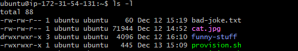

# File Permissions

- [File Permissions](#file-permissions)
  - [Does being the owner of a file mean you have full permissions on that file?](#does-being-the-owner-of-a-file-mean-you-have-full-permissions-on-that-file)
  - [Types of Permissions](#types-of-permissions)
  - [Giving Permissions to User entity](#giving-permissions-to-user-entity)
  - [Giving Permissions to Group entity](#giving-permissions-to-group-entity)
  - [Giving Permissions to Other entity](#giving-permissions-to-other-entity)
  - [You give the following permissions to a \[file: Use\](file: Us "‌")r permissions are read-only, Group permissions are read and write, Other permissions are read, write and execute. You are logged in as the user which is owner of the file. What permissions will you have on this file? Explain.](#you-give-the-following-permissions-to-a-file-usefile-us-r-permissions-are-read-only-group-permissions-are-read-and-write-other-permissions-are-read-write-and-execute-you-are-logged-in-as-the-user-which-is-owner-of-the-file-what-permissions-will-you-have-on-this-file-explain)
  - [Here is one line from the ls -l. Work everything you can about permissions on this file or directory.](#here-is-one-line-from-the-ls--l-work-everything-you-can-about-permissions-on-this-file-or-directory)
    - [-rwxr-xr-- 1 tcboony staff  123 Nov 25 18:36 keeprunning.sh](#-rwxr-xr---1-tcboony-staff--123-nov-25-1836-keeprunningsh)
  - [Numeric Values for Permissions](#numeric-values-for-permissions)
    - [What can you with the values assign read + write permissions?](#what-can-you-with-the-values-assign-read--write-permissions)
    - [What value would assign read, write and execute permissions?](#what-value-would-assign-read-write-and-execute-permissions)
    - [What value would assign read and execute permissions?](#what-value-would-assign-read-and-execute-permissions)
    - [Often, a file or directory's mode/permissions are represented by 3 numbers. What do you think 644 would mean?](#often-a-file-or-directorys-modepermissions-are-represented-by-3-numbers-what-do-you-think-644-would-mean)

## Does being the owner of a file mean you have full permissions on that file?

No, being the owner of a file does not automatically mean you have full permissions on that file. File permissions are a set of access restrictions that control who can read, write, and execute a file. These permissions are granted to the file's owner, the file's group, and anyone else who has access to the file or directory.

* The owner of a file has default permissions that allow them to read, write, and execute the file. 
* The owner can also modify these permissions to allow or deny access to others. For example, the owner could grant the group permission to read the file, or they could grant everyone permission to execute the file.

So, while being the owner of a file gives us a certain level of control over its permissions, it does not give us unlimited access. Other users may still have permissions to read, write, or execute the file, depending on how the permissions are set.

Above, we only have execute permissions for the owner and current user for read and write on two files even though they were created by the user, for example.

## Types of Permissions

Three types of permissions:
* Read -  Allows users to view the contents of a file or directory.
* Write - Enables users to modify the contents of a file or directory, create new files, and delete existing ones.
* Execute - Grants users the ability to run executable files or execute commands within a directory.

These permissions are assigned to three main entities:
* Owner - The user who created the file or directory.
* Group - The group that the file or directory belongs to.
* Others - All other users who do not own the file or directory.

## Giving Permissions to User entity

Granting permissions to the User entity refers to defining the access rights for specific users to files directories or other system resources.

## Giving Permissions to Group entity

Granting permissions to the Group entity refers to defining the access rights for a specific group to files directories or other system resources.

## Giving Permissions to Other entity

Granting permissions to the Other entity refers to defining the access rights for a other users who do not own the file or directories to specific files, directories or other system resources.

## You give the following permissions to a [file: Use](file: Us "‌")r permissions are read-only, Group permissions are read and write, Other permissions are read, write and execute. You are logged in as the user which is owner of the file. What permissions will you have on this file? Explain.

If the user permissions are read only and the owner of the file is not part of the group, then the owner of the file would only have read permissions.
However, if the user is part of the group, the owner of the file will have read and write permissions.

## Here is one line from the ls -l. Work everything you can about permissions on this file or directory.

### -rwxr-xr-- 1 tcboony staff  123 Nov 25 18:36 keeprunning.sh

The lack of a `d` means it's not a directory.
`rwx` means the owner has read, write and execute permissions on the file.
`r-x` means the group has read and execute permissions on the file.
`r--` means others have read permissions on this file.
Owner is `tcboony`
Group is `staff`
`keeprunning.sh` is name of the file.

## Numeric Values for Permissions

Each oermission is assigned a numeric value:

* r (read) = 4
* w (write) = 2
* x (execute) = 1

These values are combined to represent the permissions for the owner, group and others by adding them in threes.

### What can you with the values assign read + write permissions?

* 4(r) + 2(w) = 6

### What value would assign read, write and execute permissions?

* 4(r) + 2(w) + 1(x)= 7

### What value would assign read and execute permissions?

* 4(r) + 1(x)= 5

### Often, a file or directory's mode/permissions are represented by 3 numbers. What do you think 644 would mean?

* 6 (4+2) - which means that the user has read and write permissions.
* 4 meas that the group only has read permissions.
* 4 means that others only has read permissions.

