# Monitoring and Alert Management

- [Monitoring and Alert Management](#monitoring-and-alert-management)
  - [Worst Case to Best Case Scenario Example](#worst-case-to-best-case-scenario-example)
    - [First Scenario - Worst Case Scenario - No Monitoring](#first-scenario---worst-case-scenario---no-monitoring)
      - [Challenges](#challenges)
    - [Second Scenario - Second Worst Case Scenario - Manual Monitoring with Dashboard](#second-scenario---second-worst-case-scenario---manual-monitoring-with-dashboard)
      - [Challenges](#challenges-1)
    - [Third Scenario -Alert Management System - Second best case scenario](#third-scenario--alert-management-system---second-best-case-scenario)
      - [Create an Alarm for CPU Utilization](#create-an-alarm-for-cpu-utilization)
    - [Fourth Scenario - Automatic Response - Best case scenario](#fourth-scenario---automatic-response---best-case-scenario)

 Monitoring is like having a watchful eye, constantly scanning the entire software development and deployment process to identify potential issues, optimize performance, and ensure smooth delivery. It's not just about reactive troubleshooting, it's about proactive insights and continuous improvement.

## Worst Case to Best Case Scenario Example

### First Scenario - Worst Case Scenario - No Monitoring

In a worst case scenaio, there would not be any kind of monitoring of CPU Load of our App VM. That would make it impossible to react or prevent to when the app falls over.

#### Challenges

* Lack of visibility.
* Impossibility to prevent or react to performance issues.
* High possibility of app falling over and compromising user experience.

### Second Scenario - Second Worst Case Scenario - Manual Monitoring with Dashboard

In this scenario, we would use CloudWatch Monitoring which is a tool to be able to see how much CPU usage (amongst other things) are being used by the Virtual Machine.

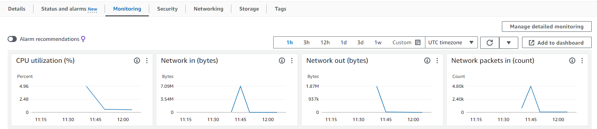

Default monitoring is set to update every 5 minutes.
We can also turn on detailed monitoring to be able to get updates more frequently (up to 1 minute apart) but this will come with additional charges.

Enable Detailed Monitoring:

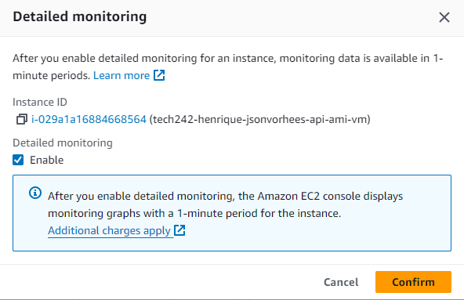

After that has been done, we can add this monitoring to the dashboard.

We can create a new dashboard if one doesn't exist, or we can select an existing dashboard and add these graphs to it.

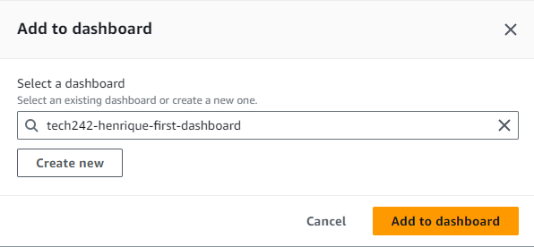

After that has been done, we are able to maximize the CPU utilization graph and set its refresh rate to one minute and check its CPU utilization to get an accurate read of the app's usage.

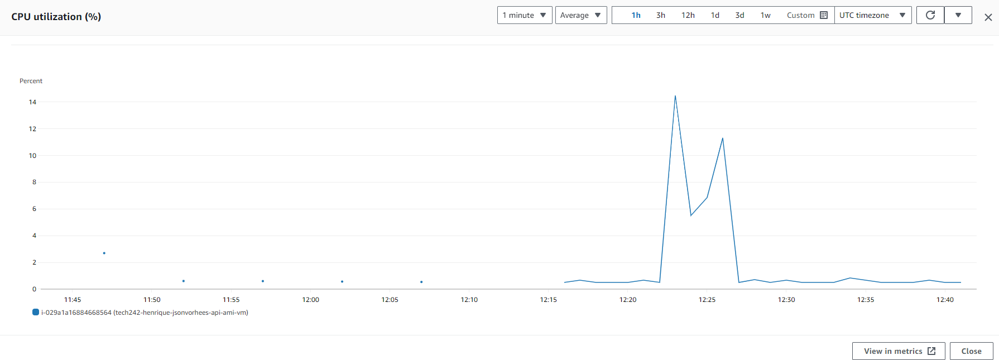

#### Challenges

* The challenges with this approach is that it is impossible for a person to keep constant watch over the dashboard.
* Human error is unavoidable and important information or situations can easily be missed.

### Third Scenario -Alert Management System - Second best case scenario

In this scenario, we'll still have CloudWatch Monitoring to check CPU load. 
We'l have an Alert Management System to send an alert to a specific member of staff when the CPU utilization reaches a particular threshold.
It's important to set the alert to be sent to the right person, i.e., someone who currently working, is on call, not asleep or in general available to respond to the situation if needed.

#### Create an Alarm for CPU Utilization

Now, we'll create an alarm for an existing EC2 Instance.

1. First, it's necessary to go to the CloudWatch section in the AWS website and select "Create Alarm".

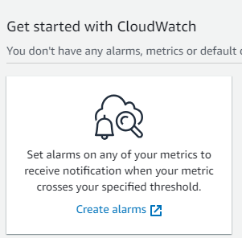

2. Next, we'll have to select the metric, choose EC2 and select Per-Instance Metrics.

3. Find instance through instance ID and select CPU Utilization Metric.

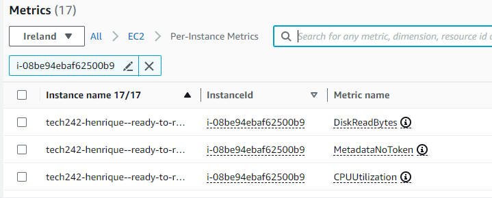

4. Set up metric and period.

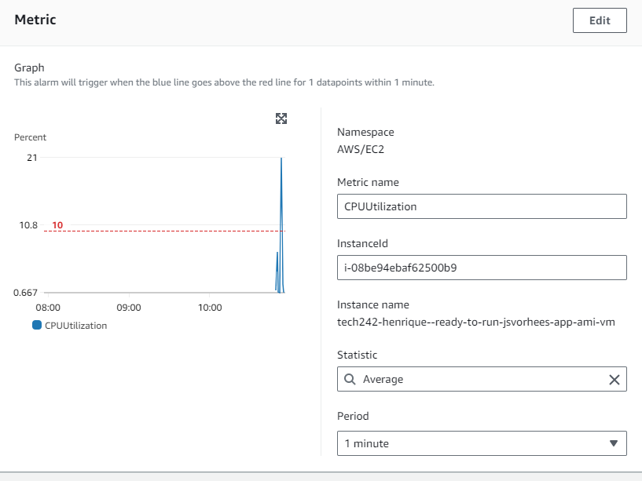

5. Set threshold type to Static, define the alarm condition and define the threshold value.

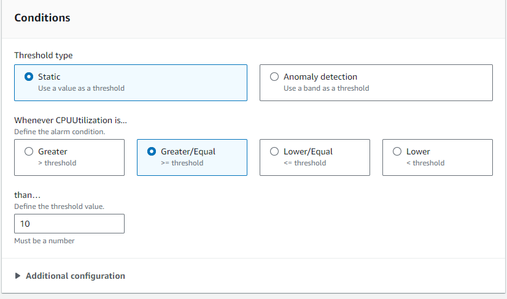

6. When setting up a notification, we'll have to create a new SNS topic, so we'll get a notification directly on our email.

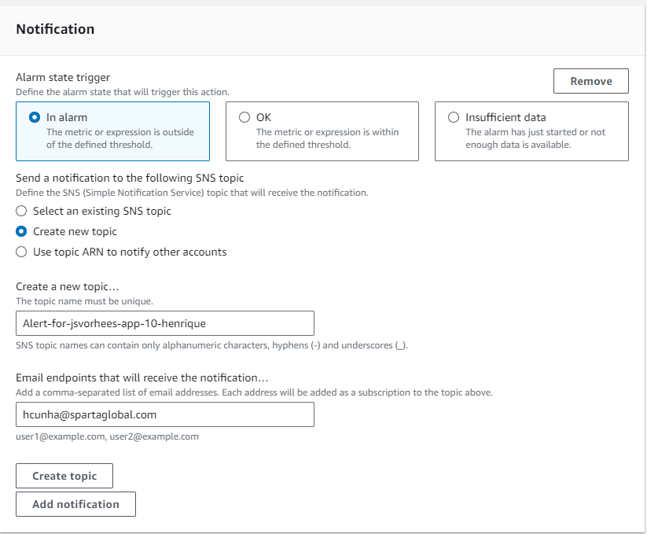

7. Alternatively, we could select an existing SNS topic and send a notification to everyone within a particular mailing group, which would be useful when working collaboratively.
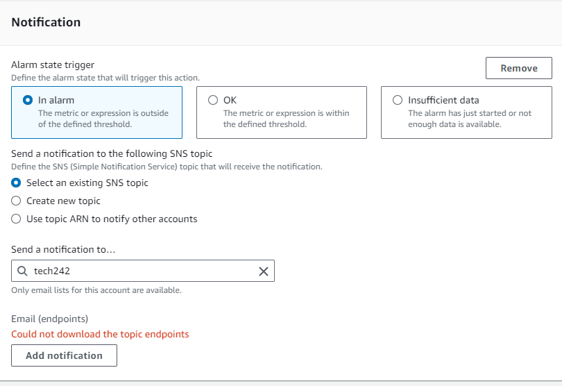

8. We'll add a name and description to the alarm. Be careful to choose a descriptive name, so it will be easier to find in the Alarms section (and impossible to change the name once set).

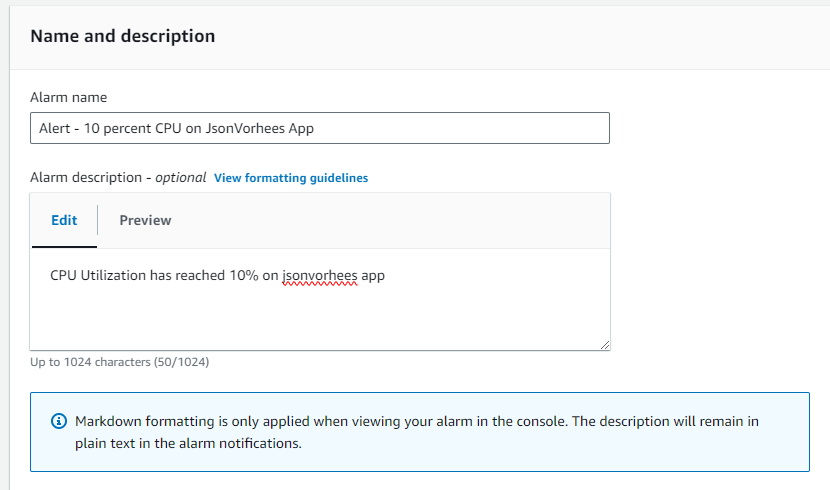

9.  Preview and create Alarm.

10. Confirm subscription to Alarm on email.
     
11. We'll receive an email when the CPU utilization goes over 10%.

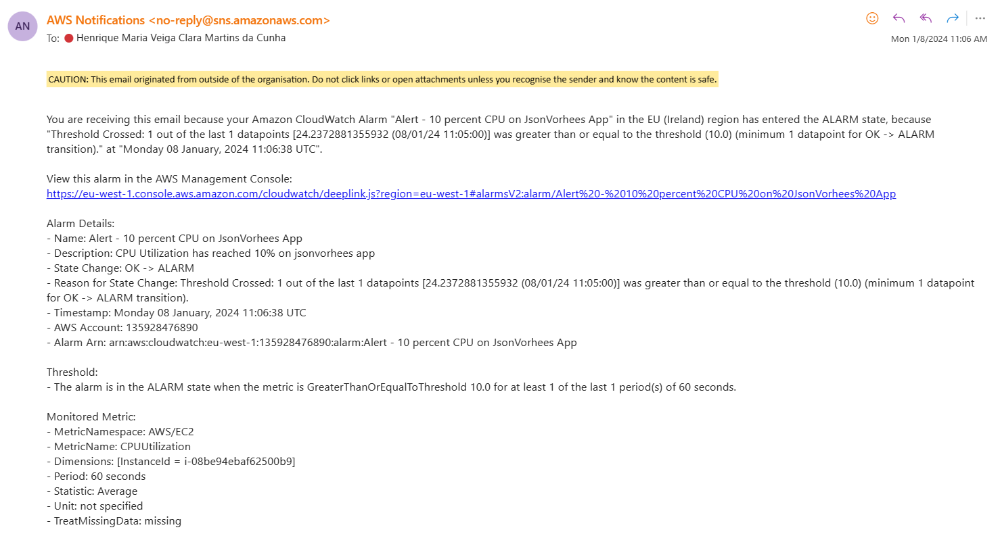

12. We can see the CPU Utilization and what triggered the alarm on CloudWatch.
    
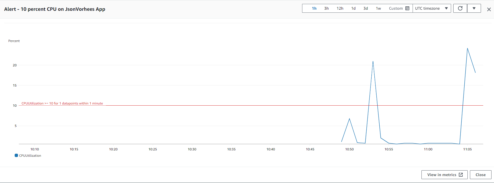

### Fourth Scenario - Automatic Response - Best case scenario

In this scenario, we'll have an auto-scaling group which is responsible to set up the virtual machines according to the demand.
Cost is the main defining factor in how many VMs we can create as each new instance will cost the company more money. 

* [Auto Scaling Groups](../auto-scaling-groups)