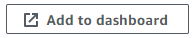

# Monitoring and Alert Management

 Monitoring is like having a watchful eye, constantly scanning the entire software development and deployment process to identify potential issues, optimize performance, and ensure smooth delivery. It's not just about reactive troubleshooting; it's about proactive insights and continuous improvement.

## Worst Case to Best Case Scenario Example

### Worst Case

In a worst case scenaio, there would not be any kind of monitoring of CPU Load of our App VM. That would make it impossible to react or prevent to when the app falls over.

### second Worst Case Scenario

In this scenario, we would use CloudWatch Monitoring which is a tool to be able to see how much CPU usage (amongst other things) are being used by the Virtual Machine.

Default monitoring is set to update every 5 minutes.
We can also turn on detailed monitoring to be able to get updates more frequently (up to 1 minute apart) but this will come with additional charges.

Enable Detailed Monitoring:

After that has been done, we can add this monitoring to the dashboard.

We can create a new dashboard if one doesn't exist, or we can select an existing dashboard and add these graphs to it.

After that has been done, we are able to maximize the CPU utilization graph and set its refresh rate to one minute and check its CPU utilization to get an accurate read of the app's usage.

