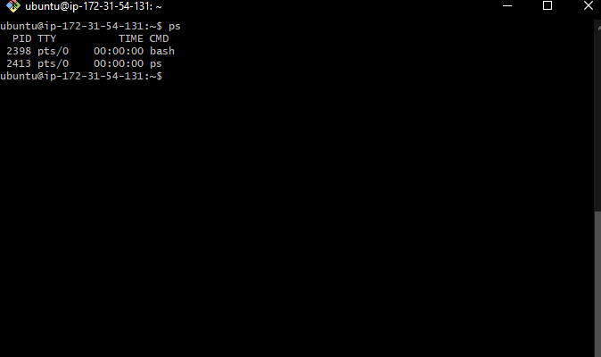

# Processes

Processes are usually run in the background and are run by the operating system.
They are in memory and look like they're possibly using the CPU:
* Sometimes they give the appearance that they're being processed but they may in fact be just present in memory.
* If a Virtual machine only has one core, it can only process one process at a time and will be constantly switching between processes.
* The VM will be giving a bit of CPU time to each process whilst another running process has to wait in queue to get its instructions done.

## Two types of Processes

### User Processes 

A user process is a running instance of a program that is started and controlled by a user.
These processes are typically initiated by the user's actions, such as running a command in a terminal.

We can use the command `ps` to check which user processes are running:

By using the `ps` command you will get the following information:
* PID - process ID, number that identifies each individual process.
* TTY - TeleTYpewriter, which indicates the terminal from which the process was started.
* TIME - 
* CMD - 

It is possible for more than one user to login via SSH to the same virtual machine at the same time.
Each terminal session also has an id and will have different processes specific to that terminal session.

### System Processes

System processes are initiated by the operating system itself to perform essential tasks such as managing hardware, scheduling tasks, and handling system events.
System processes don't provide an application or interface for the end user to actually use.
* They provide, drivers, login, file, print services. 
* It is like a middleman between hardware and software.

For example, nginx is installed by the user but it is still a system process.

#### Commands

* `ps --help -e` or `ps --help -A` will give you a list of what commands derived from `ps ` you can use.
* `man ps` will display a manual on everything about ps commands.
* `ps aux` will show all the processes with extra information such as the USER, PID, %CPU, % MEM, among others. One disadvantage is that things could have changed in that time, as it's not kept up to date.
* `top` will display all the processes and refreshes the information every 3 seconds. It ranks the processes by % of usage of CPU by default but that can be changed.

Note: A "d" at the end of a process means "daemon" and essentially means it's a process that runs in the background.

### Managing processes

Command `sleep` followed by a number will put our terminal to sleep for that number of seconds that we input.
If we use `sleep 5 &` the process will stay running in the background and keep running even if we change terminal session.
`jobs` command will show some of the processes that we run in the background.

#### Kill Command

The `kill <ProcessID>` command is used to terminate a process.
It is important to realize that the `kill` command is only to be used as a last resort.
 * First, if we cannot stop the process in any way, we'll then go through the parent process to stop the child process.
 * If it is a child process, we can kill it as it will not turn a parent process into a zombie process.
 * If the process still refuses to terminate after the kill command, we can use the brute kill command `kill -9 <ProcessID>`. 
 * It should only be done if there is no other way to stop the process!
 * If a killed process keeps reappearing, it's because it has a parent process that keeps recreating it as it's responsible for it.
 * If it is a parent process, we shouldn't kill it or brute force kill it as it will turn its child processes into zombie processes. 

Note: Zombie processes are child processes that keep on running "without direction" once its parent processes have been terminated.
