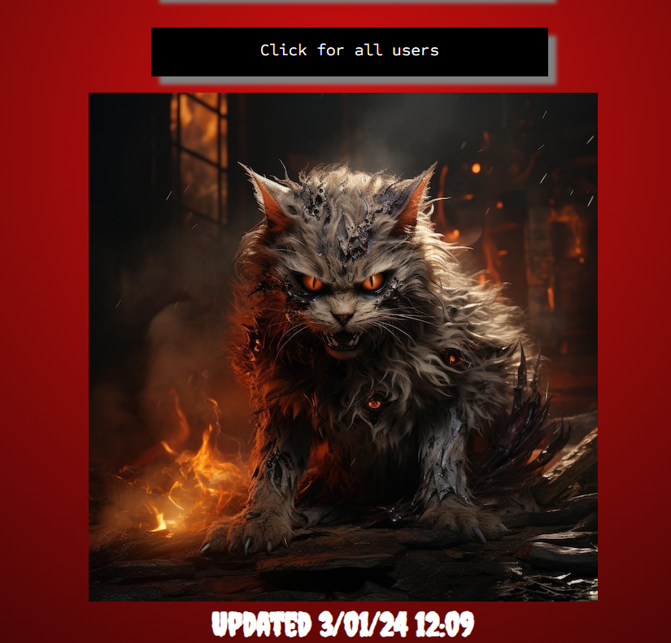
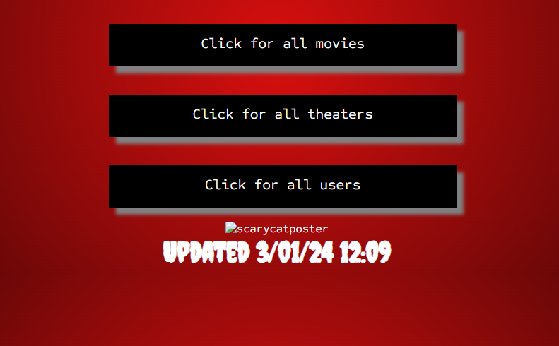
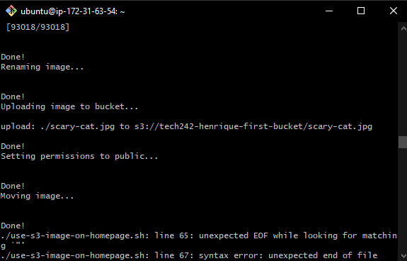

# Change home page picture to scary cat photo Script

## Download cat picture

`wget https://img.freepik.com/premium-photo/scary-cat-ai-generated_259696-3040.jpg`

## Rename image

`mv scary-cat-ai-generated_259696-3040.jpg scary-cat.jpg`

## Create Bucket (Not included in the main script but still tested)
`aws s3 mb s3://tech242-henrique-first-bucket `

## Create a variable for bucket name
`bucket_name="tech242-henrique-first-bucket"`

## Disable Block Public access
```
echo "Disabling Block public access..."
aws s3api delete-public-access-block --bucket "$bucket_name"
echo ""
```

## Define bucket policy to allow public read access
```
policy_json=$(cat <<EOF
{
  "Version": "2012-10-17",
  "Statement": [
    {
      "Effect": "Allow",
      "Principal": "*",
      "Action": "s3:GetObject",
      "Resource": "arn:aws:s3:::$bucket_name/*"
    }
  ]
}
EOF
)
```

# Configure S3 Bucket

```
echo "Configuring S3 Bucket..."
aws s3api put-bucket-policy --bucket "$bucket_name" --policy "$policy_json"
echo "Done"
```

## Upload to bucket

`aws s3 cp scary-cat.jpg s3://tech242-henrique-first-bucket`

## Download image from bucket to crrent working directory

`aws s3 cp s3://tech242-henrique-first-bucket/scary-cat.jpg .`

## Move image to correct repository

`sudo mv ~/scary-cat.jpg /repo/springapi/src/main/resources/static/images/scary-cat.jpg`


## change image
```
if grep -q 'src="/images/scary-cat.jpg"' /repo/springapi/src/main/resources/templates/home.html; then
    echo "Cat Image already there."
else
    echo "Changing image to scary cat picture..."
    sudo sed -i 's|||g' /repo/springapi/src/main/resources/templates/home.html
fi
```

## Move into correct repository
```
cd /repo
cd springapi
```
## Load image into running application

`sudo mvn package`


## End Result:



## Blockers:

I've experienced two main blockers: One in the manual testing stage, and the other in the automating script stage.

* Manual testing Blocker:
	* This blocker happened because the vm wasn't being able to change the image to another image that wasn't located within the same path that friday the 13th image was.
	* I shifted my approach and upon downloading the image from the s3 bucket, I moved it into that same repository and then ran the command again.



* Automating Script Stage:
  * This blocker happened due to a simple syntax error in an echo command inside an if block.
  * It was fixed by closing the quotation marks.



