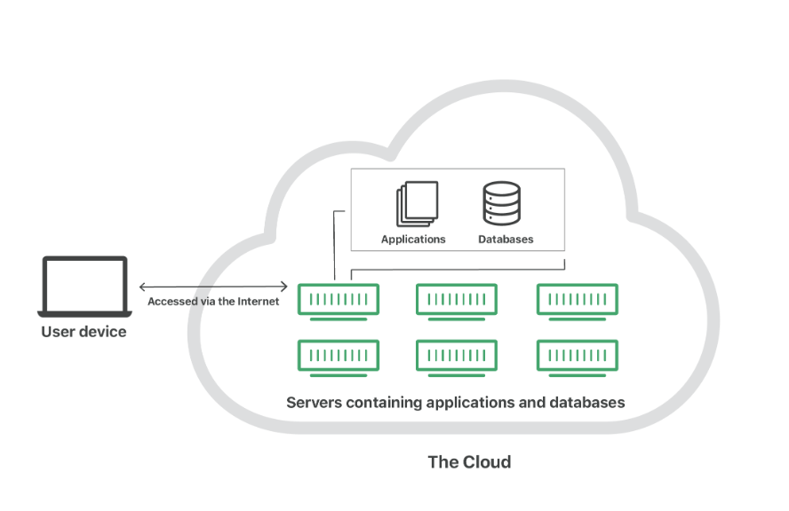
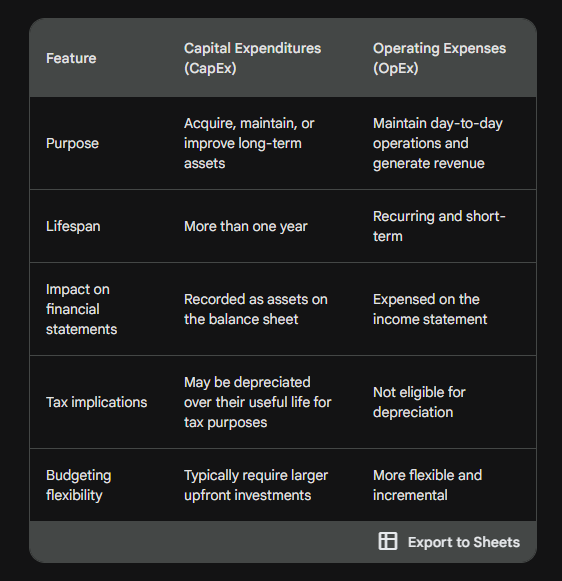
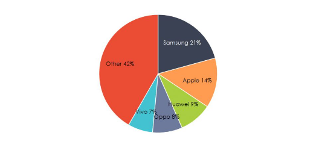
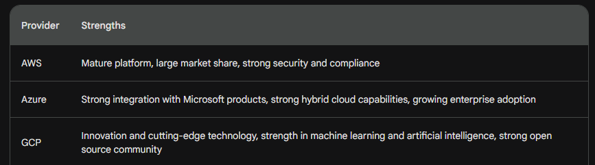
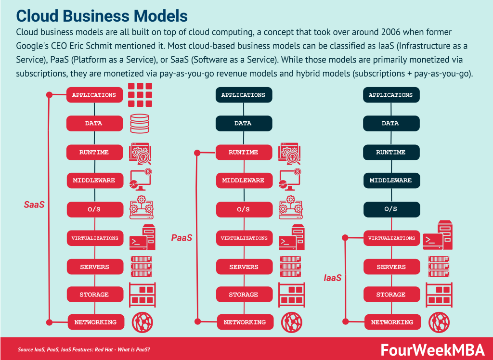

# What is the Cloud?

The cloud is a term that refers to a group of remote servers that are connected to the Internet and that can be accessed by users to store data, run applications, and access other services. Cloud computing is the on-demand delivery of computer system resources, especially data storage and computing power, without active management by the user.

* Servers that are accessed over the internet, and the software and databases that run on those servers.
* Cloud servers are located in data centers all over the world.
* By using cloud computing, users and companies do not have to manage physical servers themselves or run software aplications on their own machines.

* The cloud enables users to access the same files and applications from almost any device, because the computing and storage takes place on servers in a data center, instead of locally on the user device. 
* This is why a user can log in to their Steam account on a new laptop after their old laptop breaks and still find their old account in place with all their games and saved files. It works the same with gmail or microsoft office 365, dropbox or google drive.

### How does cloud computing work?

Cloud computing is possible because of a technology called virtualization.

Virtualization: 

* Virtualization allows for the creation of a simulated digital-only "virtual" computer that behaves as if it were a physical computer with its own hardware.
* They're called virtual machines.
* Virtual machines are sandboxed from one another. -> Sandboxing is a way of isolationg specific programs and apps.
* It's the act of sectioning off a program on your hard drive so that its exposure to the rest of your apps and critical systems is minimized or eliminated.

### What are cloud services?

The resources available in the cloud are known as services, since they are actively managed by a cloud provider.
Cloud services include infrastructure, applications, development tools, and data storage, among other products.
These services are sorted into several different categories or service models:

* Software-as-a-Service (SaaS): Instead of users installing an application on their device, SaaS applications are hosted on cloud servers and users access them over the internet. It's like cloud gaming, you don't have to install the game on your physical hardware but we get to play the game as if it was installed on our local machine.
* 
* Platform-as-a-Service (PaaS): Companies don't pay fo hosted applications, but for the things they need to build their own applications. 
  * Development tools.
  * Infrastructures
  * Operating Systems
  * Like renting all the tools you need to build a house, instead of renting the house itself.
* Infrastructure-as-a-Service (IaaS): In this model, a company ents the servers and storage they need from a cloud provider. They then use that cloud infrastructure to build their own applications. It's like leasing a plot of land to let them build whatever they want but the povide all thei tools and equipment.
* Function-as-a-Service (FaaS) : Serverless computing, breaks cloud applications down into even smaller components that only run when they are needed. Imagine if it were possible to rent a house one little bit at a time: for instance, the tenant only pays for the dining room at dinner time, the bedroom while they are sleeping, the living room while they are watching TV, and when they are not using those rooms, they don't have to pay rent on them.
  * FaaS or serverless applications still run on servers, as do all these models of cloud computing. But they are called "serverless" because they do not run on dedicated machines, and because the companies building the applications do not have to manage any servers.

### There are Four main TYPES of cloud deployment:

* Public cloud: This is the type of cloud that is most familiar to most people. Public clouds are owned and operated by companies like Amazon Web Services (AWS), Microsoft Azure, and Google Cloud Platform (GCP). These clouds are available to anyone with an Internet connection, and they are typically priced on a pay-as-you-go basis.

* Private cloud: This type of cloud is hosted within a company's own data center. Private clouds are typically used by large organizations that have sensitive data that they do not want to share with a third-party provider.

* Hybrid cloud: This type of cloud is a combination of a public cloud and a private cloud. Hybrid clouds are used by organizations that want to get the flexibility and scalability of a public cloud, but also want to maintain control over their data and security.

* Multi-cloud: multi-cloud is a type of cloud deployment that involves using multiple public clouds. In other words, an organization with a multi-cloud deployment rents virtual servers and services from several external vendors — to continue the analogy used above, this is like leasing several adjacent plots of land from different landlords. Multi-cloud deployments can also be hybrid cloud, and vice versa.

### The cloud has several advantages over traditional on-premises computing, including:

* Scalability: Cloud resources can be scaled up or down quickly and easily to meet changing needs.

* Cost-effectiveness: Cloud computing can be more cost-effective than on-premises computing, especially for organizations with fluctuating workloads.

* Accessibility: Cloud resources can be accessed from anywhere with an Internet connection.

* Security: Cloud providers invest heavily in security, and cloud services are typically more secure than on-premises solutions.

* Reduced IT Administration: Cloud providers handle the day-to-day maintenance and updates of IT infrastructure, freeing up internal IT staff to focus on strategic initiatives and value-added activities. This reduces operational overhead and improves overall efficiency.

* Access to Innovative Technologies: Cloud providers offer access to a wide range of innovative technologies, including artificial intelligence, machine learning, and big data analytics, without the need for businesses to invest in developing or maintaining these capabilities in-house.

### It also has disadvantages like: 

* Data Security Concerns: While cloud providers generally employ robust security measures, there's a heightened risk of data breaches or unauthorized access due to the remote nature of cloud storage. Businesses need to carefully evaluate the security practices of cloud providers and implement additional security measures to safeguard their data.

* Vendor Lock-in: Using proprietary cloud services from a single provider can lead to vendor lock-in, making it difficult to switch providers or integrate with other software applications. Businesses need to carefully consider their long-term IT strategy and evaluate cloud providers based on their flexibility and interoperability.

* Dependency on Internet Access: Cloud services are reliant on internet connectivity. Businesses need to have a reliable internet connection to ensure uninterrupted access to their data and applications. This dependency can be a challenge in areas with limited or unreliable internet access.

* Potential Data Transfer Fees: Depending on their cloud usage, businesses may incur data transfer fees when moving data between different cloud regions or on-premises locations. Careful planning and data optimization can minimize these costs.

* Data Compliance Issues: Businesses need to comply with various data privacy regulations, such as GDPR and CCPA, when storing and processing data in the cloud. Cloud providers should provide adequate data residency options and certifications to meet compliance requirements.

### CapEx vs OpEx

#### Capital Expenditures (CapEx)

Capital expenditures refer to expenses incurred to acquire, maintain, or improve long-term assets that are expected to benefit the company for an extended period. These assets typically have a lifespan of more than a year and contribute to the company's overall value. 
  * Purchase of physical assets: Land, buildings
  * Technology investments: hardware, softwae
  * Research and Development

#### Operating Expenses (OpEx)

Operating expenses, on the other hand, are expenses incurred in the day-to-day running of the business. These expenses are typically recurring and are for the purpose of maintaining the company's operations and generating revenue.
  * Salaries
  * Rent, utilities
  * Advertising
  * Customer Support

### Market share 

Market share is a crucial metric for businesses to gauge their performance and position within a particular industry or market. It represents the percentage of total sales or revenue generated by a company compared to the overall market. A higher market share indicates a stronger position and greater influence in the industry.

* Market leaders: These companies typically hold the majority of market share, often exceeding 50%. They are often well-established brands with a strong brand reputation and a loyal customer base.

* Major players: These companies occupy a significant portion of the market, often holding between 10% to 49% of market share. They may be direct competitors to the market leaders or hold a strong position in a specific product or service category.

* Challengers: These companies are striving to gain market share and position themselves as contenders in the industry. They may be newer entrants or established companies seeking to expand their market reach.

* Niche players: These companies focus on specific market segments or product categories and hold a smaller share of the overall market. They may cater to niche customer groups or provide specialized products or services.

### 4 Pillars of DevOps

DevOps is a set of practices that aims to shorten the software development lifecycle by automating the processes between software development and IT operations. The four pillars of DevOps are:

* Culture and mindset: The foundation of DevOps is a cultural shift that fosters collaboration and communication between development and operations teams. This involves breaking down silos, embracing experimentation, and valuing continuous improvement.

* Continuous integration and continuous delivery (CI/CD): CI/CD is a set of practices that automate the process of integrating code changes from developers into the main codebase and delivering them to production as quickly as possible. This helps to improve the quality and reliability of software releases.

* Infrastructure as code (IaC): IaC is a technique for managing IT infrastructure using code. This allows infrastructure to be provisioned, configured, and managed in a repeatable and consistent manner, which helps to reduce manual errors and improve the overall agility of the IT organization.

* Monitoring and logging: Monitoring and logging are essential for ensuring the health and performance of applications and infrastructure. DevOps teams use a variety of tools to collect and analyze data from these sources, which helps them to identify and resolve issues quickly.

#### How cloud computing link into the cloud

Cloud computing can be a powerful enabler of DevOps practices. By providing on-demand access to computing resources, cloud platforms can help organizations scale their infrastructure up or down quickly to meet changing demand. This can be especially beneficial for organizations that are developing and deploying software in a continuous manner.

Here are some specific examples of how cloud computing can be used to support DevOps practices:

* CI/CD pipelines can be automated using cloud-based tools and services. This can help to free up developers to focus on more creative tasks, while operations teams can focus on ensuring the quality and reliability of deployments.

* Cloud-based infrastructure can be provisioned and managed using IaC tools. This can help to ensure that infrastructure is consistent and up to date, which can help to reduce the risk of errors and downtime.

* Cloud-based monitoring and logging tools can provide real-time visibility into the health and performance of applications and infrastructure. This can help DevOps teams to identify and resolve issues quickly, before they impact users.

### Three largest cloud Providers

The three largest cloud providers in the world are Amazon Web Services (AWS), Microsoft Azure, and Google Cloud Platform (GCP). Each provider offers a wide range of cloud services, but they also have several key strengths that make them popular with businesses of all sizes.

* Amazon Web Services (AWS)
  * Mature platform with a wide range of services: AWS is the oldest and most mature cloud provider, and it offers the most comprehensive suite of services. This includes a wide range of compute, storage, networking, database, analytics, and machine learning services.
  * Largest market share: AWS has the largest market share of any cloud provider, and it is the most popular choice for businesses of all sizes.
  * Strong security and compliance: AWS is known for its strong security and compliance offerings. It is a popular choice for businesses that need to meet complex security and regulatory requirements.

* Microsoft Azure
  * Strong integration with Microsoft products: Azure is tightly integrated with Microsoft's other products, such as Office 365 and Windows Server. This makes it a good choice for businesses that already use Microsoft products.
  * Strong hybrid cloud capabilities: Azure is a good choice for businesses that want to run workloads both on-premises and in the cloud. It offers a wide range of hybrid cloud solutions.
  * Growing enterprise adoption: Azure is rapidly gaining market share among enterprise customers. This is due in part to its strong hybrid cloud capabilities and its integration with Microsoft products.
  
* Google Cloud Platform (GCP)
  * Innovation and cutting-edge technology: GCP is known for its innovation and cutting-edge technology. It offers a number of unique features, such as its Kubernetes Engine and its BigQuery data warehouse.
  * Strength in machine learning and artificial intelligence: GCP is a leader in machine learning and artificial intelligence. It offers a wide range of services for developing and deploying AI applications.
  * Strong open source community: GCP is a strong supporter of the open source community. It offers a wide range of open source tools and services.

### Cloud computing Business Model

* Software as a Service (SaaS)
* Infrastructure as a Service (IaaS)
* Platform as a Service (PaaS)
  
Cloud computing businesses generate revenue in a number of ways:

* Subscription fees: Businesses charge customers a monthly or annual subscription fee for access to their cloud services.

* Per-usage fees: Businesses charge customers for the amount of resources they consume, such as the amount of storage they use or the number of transactions they perform.

* Value-added services: Businesses offer additional services, such as consulting, training, and support, to their customers.
  

### Steam Case Study

Valve Corporation, the developer and publisher of popular games like Half-Life, Dota 2, and Counter-Strike: Global Offensive, is also the creator of the Steam digital distribution platform, one of the most popular gaming marketplaces in the world. With over 120 million active users, Steam handles a massive amount of data and traffic, making it crucial for Valve to utilize cloud computing to ensure a seamless and efficient user experience.

Challenges and Goals

Maintaining the high availability and scalability of Steam's infrastructure was a significant challenge for Valve. As the platform grew in popularity, the number of concurrent users soared, putting immense pressure on the on-premises servers. This led to performance issues, such as increased latency and load times, which negatively impacted the gaming experience.

To address these challenges, Valve set out to achieve the following goals:

Scalability: Automate the provisioning and scaling of cloud resources to match the dynamic demands of Steam's user traffic, ensuring smooth performance even during peak usage periods.

Reliability: Enhance the resilience of the infrastructure to prevent downtime and minimize disruptions to player experiences.

Cost-efficiency: Optimize resource utilization and reduce the overall cost of running the Steam platform, allowing for more investment in game development and content creation.

Cloud Adoption Strategy

Valve adopted a hybrid cloud approach, combining cloud-based services with its on-premises infrastructure to strike a balance between scalability, reliability, and cost-effectiveness. The company utilized Amazon Web Services (AWS) as its primary cloud provider, leveraging its global network of data centers, extensive compute and storage capabilities, and mature cloud services.

Benefits and Outcomes

The cloud adoption has brought several benefits to Steam's operations:

Enhanced Scalability: AWS's elasticity allows Valve to dynamically scale its cloud resources up or down based on real-time user traffic. This ensures that the platform can handle peak usage periods without compromising performance.

Improved Reliability: AWS's high availability features and disaster recovery mechanisms have significantly reduced downtime and prevented disruptions to player experiences. This has enhanced customer satisfaction and brand reputation.

Reduced Costs: By leveraging AWS's pay-as-you-go pricing model, Valve has optimized resource utilization and achieved significant cost savings. The company is no longer locked into expensive on-premises infrastructure and can scale its cloud resources based on actual demand.

Agility: The cloud platform has empowered Valve to accelerate the development and deployment of new features, updates, and content for Steam. Developers can access and provision cloud resources on-demand, enabling faster iteration and innovation.

Overall Impact

Valve's cloud adoption has transformed the operation and scale of Steam, enabling the company to provide a more reliable, responsive, and cost-effective gaming experience for its users. The platform's popularity has continued to grow, and Valve has been able to maintain its position as the leading digital gaming marketplace.